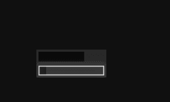

# TristansTrackers

TristansTrackers is a minimal, always-on-top Windows timer HUD. Its compact
one-second progress bar provides a persistent visual rhythm, while optional
alarm timers add longer countdowns without getting in the way of your work.



## Features

- A continuously filling one-second tracker with a pulse at completion.
- One alarm at a time, with presets from 1 minute to 2 hours.
- An alarm bar that fills from left to right and shows the remaining whole
  minutes on hover.
- Sleep-aware countdown timing while the app remains open.
- A Windows alert and large pulsing alarm icon at expiry, shown until dismissed.
- Square, opaque custom HUD menus for alarm selection and exiting the app that
  remain above the timer bars.
- Drag-to-position and lock controls, with the position saved between launches.
- A borderless, always-on-top window hidden from the taskbar and Alt+Tab list.

## Requirements

- Windows 10 or later.
- The packaged release is self-contained and requires no separate .NET install.
- Building from source requires the .NET 8 SDK or Visual Studio 2022 with the
  WPF workload installed.

## Quick Start

From the repository root:

```powershell
dotnet restore
dotnet build TristansTrackers.sln
dotnet run --project TristansTrackers.csproj
```

Packaged, self-contained Windows builds are also available from the
[GitHub Releases](https://github.com/buttery-x3/TristansTrackers/releases) page.

## Usage

- Drag the bar with the left mouse button to move it.
- Use the lock button to toggle whether the bar can be moved.
- Hover over the bar and select the alarm-clock button to start a 1, 2, 5, 10,
  15, 20, 30, 45, 60, or 90-minute alarm, or a 2-hour alarm.
- While an alarm is active, its bar fills from left to right. Hover to see its
  remaining whole minutes, or open the alarm menu again to replace or cancel
  it.
- When an alarm expires, its bar is replaced by a large alarm-clock icon above
  the tracker spanning the timer bar's width. Click either alarm-clock icon to
  dismiss it.
- Active alarms are not restored after the app exits.
- Right-click the tracker to open its square dark HUD command menu. The alarm
  picker uses the same menu system and stays above the tracker bars.
- The window is always on top of normal windows.
- The window is hidden from the taskbar and Alt+Tab list.

## Configuration

TristansTrackers stores its window position and size in:

```text
%APPDATA%\TristansTrackers\timebar_config.json
```

The file is created automatically on first launch. If the saved position is not
set yet, the app centers the bar on the primary monitor work area and saves that
initial position.

## Development Notes

See [DEVELOPMENT.md](DEVELOPMENT.md) for architecture notes, runtime flow, the
configuration schema, and the current build baseline.

## License

This project is licensed under the GNU Affero General Public License v3.0. See
[LICENSE.txt](LICENSE.txt).
